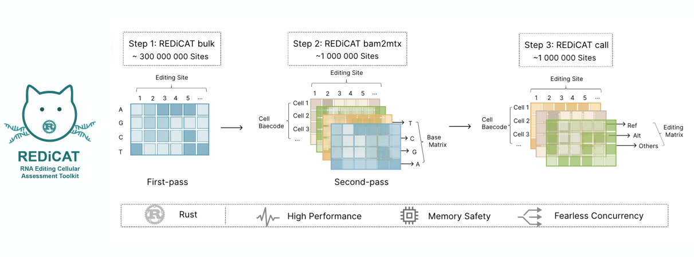
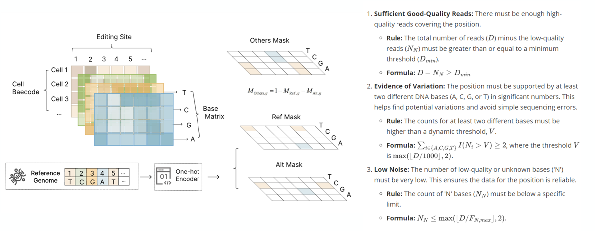

# REDICAT · RNA Editing Cellular Assessment Toolkit

**REDICAT** is a high-throughput Rust toolkit for exploring RNA editing events in both bulk and **single-cell sequencing** experiments. The command-line interface ships three production pipelines—`bulk`, `bam2mtx`, and `call`—all built on a shared library that emphasizes lock-free parallelism, sparse data structures, and deterministic output.



## Citation
If REDICAT supports your research, please cite:
> Wei, T., Li, J., Lei, X., Lin, R., Wu, Q., Zhang, Z., Shuai, S., & Tian, R. (2025). Multimodal CRISPR screens uncover DDX39B as a global repressor of A-to-I RNA editing. *Cell Reports, 44*(7). https://doi.org/10.1016/j.celrep.2025.116009


## Highlights
- **Canonical-contig smart defaults:** By default every command operates on the primary human chromosomes (chr1–chr22, chrX, chrY, chrM). Add `--allcontigs` to opt into decoys, patches, or spike-ins when you need full genome coverage.
- **On-the-fly site vetting:** Depth, N-content, and editing-support thresholds mirror the `bulk` heuristics so only confident loci advance to matrix assembly.
- **Fearless concurrency:** Rayon thread pools, crossbeam channels, and reader pooling keep pileup traversal and sparse matrix assembly fully saturated on modern CPUs.
- **Sparse-first analytics:** All matrix work is written against CSR matrices with adaptive density hints so memory usage tracks the number of edited positions, not the theoretical genome size.
- **AnnData-native exports:** The toolkit produces `.h5ad` files that slot directly into Python-based workflows (Scanpy, scVI, Seurat via conversion).




## Repository Layout
```
src/
  main.rs                 # CLI entry point
  commands/
    base_depth.rs         # `bulk` implementation
    bam2mtx.rs            # `bam2mtx` CLI / two-pass wiring
    call.rs               # End-to-end editing analysis
  lib/
    bam2mtx/              # BAM ➜ sparse matrix library
    call/                 # Editing analytics primitives
    par_granges.rs        # Parallel region iterator
    read_filter.rs        # MAPQ-based filter abstraction
```

## Installation
```bash
# Clone and build
git clone https://github.com/aStudyingTurtle/redicat.git
cd redicat
cargo build --release

# Optional: install into Cargo's bin directory
cargo install --path .
```

Binary artifacts live at `target/release/redicat` after compilation.

## Quick Start
```bash
# Discover high-confidence editing sites on canonical chromosomes
redicat bulk sample.bam -o sites.tsv.gz --threads 16

# Generate single-cell mismatch matrices using a two-pass workflow
redicat bam2mtx --bam sample.bam --barcodes barcodes.tsv \
                --output counts.h5ad --two-pass --threads 16

# Tune coverage heuristics with `--min-depth`, `--max-n-fraction`, and `--editing-threshold` to mirror bulk filtering when necessary.

# Run the RNA editing analysis pipeline on the produced AnnData matrix
redicat call --input counts.h5ad --output results.h5ad \
             --fa GRCh38.fa --site-white-list sites.tsv.gz
```

Add `--allcontigs` to any command that should consider every contig in the BAM header instead of the canonical subset.

## Subcommands
### `bulk`
Calculates per-base depth and nucleotide counts across a BAM/CRAM. Filtering options allow you to tune MAPQ, base quality, minimum depth, and an editing-specific heuristic. Results stream to a bgzip-compressed TSV.
Some libraries of `bulk` were taken form the [`perbase`](https://github.com/sstadick/perbase) project.

Option reference:

| Short | Long                  | Description                                           | Default         |
| ----- | --------------------- | ----------------------------------------------------- | --------------- |
| —     | `<reads>`             | Input indexed BAM/CRAM to analyze.                    | required        |
| `-o`  | `--output`            | Output path (bgzip added when missing).               | required        |
| `-t`  | `--threads`           | Worker threads for pileup traversal.                  | `10`            |
| `-c`  | `--chunksize`         | Ideal basepairs per worker (`ParGranges` chunk).      | `500000`        |
| `-Q`  | `--min-baseq`         | Base-quality floor; lower bases counted as `N`.       | `30 (implicit)` |
| `-q`  | `--mapquality`        | Minimum mapping quality accepted.                     | `255`           |
| `-z`  | `--zero-base`         | Emit 0-based coordinates instead of 1-based.          | `false`         |
| `-D`  | `--max-depth`         | Depth ceiling; near-max flagged as suspect.           | `8000`          |
| `-d`  | `--min-depth`         | Minimum coverage required to report a site.           | `10`            |
| `-n`  | `--max-n-fraction`    | Maximum tolerated N fraction (depth / value).         | `20`            |
| `-a`  | `--all`               | Report all sites rather than editing-enriched subset. | `false`         |
| `-et` | `--editing-threshold` | Depth divisor when checking for editing support.      | `1000`          |
| `-A`  | `--allcontigs`        | Traverse every contig instead of canonical set.       | `false`         |

### `bam2mtx`
Converts barcoded BAMs into sparse AnnData matrices (per base, per barcode, strand-aware). Accepts precomputed site lists or can bootstrap one via `--two-pass`, which internally runs `bulk` with the same contour filters.

Highlights:
- TSV positions are filtered to canonical contigs unless `--allcontigs` is specified.
- Depth/N/editing thresholds drop low-quality loci before matrix assembly, matching the first-pass `bulk` defaults.
- Reader pools and chunk-aware parallelism keep pileups cache-friendly while streaming chunk results to bound memory.
- Output matrices respect the density hint supplied via `--matrix-density`.

Option reference:

| Short | Long                  | Description                                                    | Default  |
| ----- | --------------------- | -------------------------------------------------------------- | -------- |
| `-b`  | `--bam`               | Input indexed BAM/CRAM file.                                   | required |
| —     | `--tsv`               | Optional site list TSV (columns `CHR` and `POS`).              | optional |
| —     | `--barcodes`          | Cell barcode whitelist (one per line).                         | required |
| —     | `--two-pass`          | Run `bulk` first to build a fresh site list.                   | `false`  |
| `-o`  | `--output`            | Output AnnData (`.h5ad`) path.                                 | required |
| `-t`  | `--threads`           | Worker threads for pileup + AnnData writing.                   | `10`     |
| `-q`  | `--min-mapq`          | Minimum mapping quality per read.                              | `255`    |
| `-Q`  | `--min-baseq`         | Minimum base quality; lower bases count as `N`.                | `30`     |
| `-d`  | `--min-depth`         | Minimum non-`N` coverage to keep a site.                       | `10`     |
| `-n`  | `--max-n-fraction`    | Maximum tolerated ambiguous fraction (depth / value).          | `20`     |
| `-et` | `--editing-threshold` | Ensures at least two bases exceed `depth / editing-threshold`. | `1000`   |
| `-s`  | `--stranded`          | Treat UMIs as strand-aware.                                    | `false`  |
| —     | `--umi-tag`           | BAM tag containing UMI sequence.                               | `UB`     |
| —     | `--cb-tag`            | BAM tag containing cell barcode.                               | `CB`     |
| `-r`  | `--reference`         | Reference FASTA (required for CRAM).                           | optional |
| `-c`  | `--chunksize`         | Genomic positions per processing chunk.                        | `3000`   |
| —     | `--matrix-density`    | Hint for CSR buffer sizing.                                    | `0.005`  |
| `-A`  | `--allcontigs`        | Include decoys and noncanonical contigs.                       | `false`  |

### `call`
Executes the full RNA editing pipeline on `.h5ad` inputs: variant annotation, strand-aware ref/alt counting, CEI computation, and mismatch statistics. Validation steps ensure reference FASTA, white-list TSV, and input AnnData all exist and are readable before work begins.

Important options:
- `--editingtype` · choose among AG, AC, AT, CA, CG, CT editing signatures.
- `--min-coverage` · per-site coverage filter before CEI calculation.
- `--threads` · configure Rayon pool size (defaults to 2 for stability).

## Performance Notes
- **Reader pooling:** Each worker thread checks out an `IndexedReader` from a pool, avoiding reopen/seek penalties when iterating across genomic tiles.
- **Triplet batching:** Sparse matrices are assembled from thread-local batches of `(row, col, value)` triplets, eliminating cross-thread contention.
- **Adaptive chunking:** CLI `--chunksize` values govern the parallel granularity for both `ParGranges` (bulk) and `bam2mtx` chunk processors and double as the AnnData write batch size.
- **Streaming aggregation:** `bam2mtx` reduces chunk results incrementally, keeping memory proportional to the number of confident loci rather than the full site list.

## Testing & Data
```bash
# REDIportal3 white-list, for use with `call`
wget https://comics.med.sustech.edu.cn/static_data/redicat/data/rediportal3.tsv.gz

# 10X 3' 20K_PBMC data
# chr22
wget https://comics.med.sustech.edu.cn/static_data/redicat/data/chr22.bam
wget https://comics.med.sustech.edu.cn/static_data/redicat/data/chr22.bam.bai
# cell barcodes
wget https://comics.med.sustech.edu.cn/static_data/redicat/data/barcodes.tsv.gz
```
A minimal BAM (`test/chr22.bam`) and index are included for smoke tests. Run `cargo test` to execute unit tests that exercise pileup traversal and CLI argument parsing.
