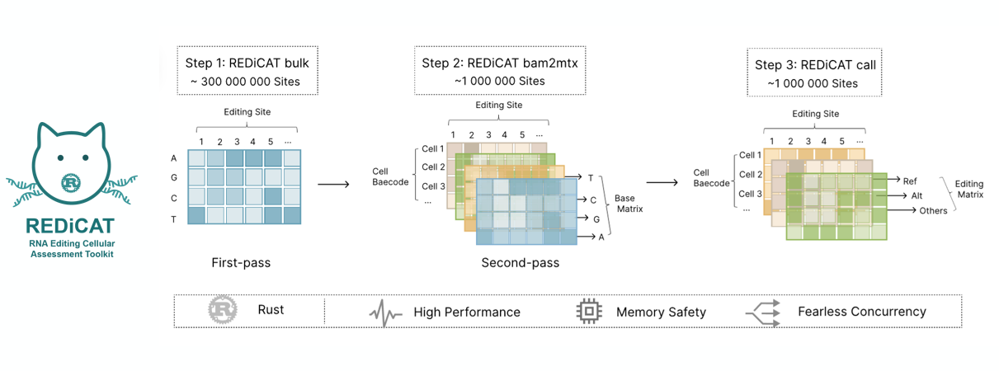
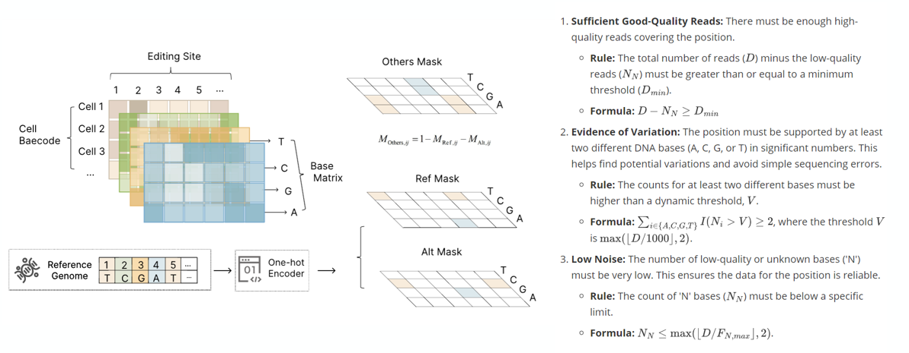

# REDICAT - RNA Editing Cellular Assessment Toolkit
[](https://opensource.org/licenses/MIT)
[](https://github.com/aStudyingTurtle/redicat_rust/actions)
[](https://www.rust-lang.org/)

REDICAT (RNA Editing Cellular Assessment Toolkit) is a highly parallelized utility for analyzing RNA editing events in single-cell RNA-seq data. Originally designed for detecting indels in reduced representation sequencing data, REDICAT has been extended to include powerful functionality for comprehensive RNA editing analysis.

REDICAT is built on **Rust**, a systems programming language, and is precompiled into binary code, delivering **exceptional performance and robust concurrency capabilities**.



The toolkit provides several analysis modules:
- `bulk`: Calculate depth and nucleotide counts at each base position
- `bam2mtx`: Convert BAM files to single-cell matrices
- `preprocess`: Filter BAM files based on various criteria
- `call`: RNA editing detection and analysis pipeline

If a metric is missing or performance is lacking, please file a bug/feature ticket in issues.


Please cite us:

```
Wei, T., Li, J., Lei, X., Lin, R., Wu, Q., Zhang, Z., Shuai, S., & Tian, R. (2025). Multimodal CRISPR screens uncover DDX39B as a global repressor of a-to-I RNA editing. Cell Reports, 44(7). https://doi.org/10.1016/j.celrep.2025.116009
```


## Quick Start

```bash
# Download the latest release
wget https://github.com/aStudyingTurtle/redicat/releases/download/latest/redicat
chmod 777 redicat
./redicat

# Filter BAM file
redicat preprocess --barcodes barcodes.tsv.gz --inbam input.bam --outbam filtered.bam

# Analyze candidate editing sites
redicat bulk --edited input.bam -o positions.tsv.gz

# Convert BAM to single-cell base mismatch matrix
redicat bam2mtx --bam input.bam --tsv positions.tsv.gz --barcodes barcodes.tsv.gz --output matrix.h5ad

# Call candidate RNA editing events with potiential biological insights and generate the editing events matrix for downstream analyse (ref, alt, others)
# It is recommand to use site-white-list form some databases like REDiPortal. It is a tsv format table with CHROM and POS column (fitst 2 columns).
redicat call --input input.h5ad --output output.h5ad --fa reference.fa --site-white-list editing_sites.tsv.gz
```

## Installation

### Prerequisites

- Rust (latest stable version)
- Cargo

### Building from Source

```bash
# Clone the repository
git clone https://github.com/aStudyingTurtle/redicat_rust.git
cd redicat_rust

# Build the project
cargo build --release

# The executable will be located at target/release/redicat
```

### Quick Installation

For a quick installation without cloning the repository:

```bash
cargo install --git https://github.com/aStudyingTurtle/redicat_rust.git
```

## Tools

### bulk

The `bulk` tool walks over every position in the BAM/CRAM file and calculates the depth, as well as the number of each nucleotide at the given position. Additionally, it counts the numbers of Ins/Dels at each position.
Some libs of the `bulk` tool are from [perbase](https://github.com/sstadick/perbase).


```bash
redicat bulk --edited ./test/test.bam
```

Usage:

```text
Calculate the depth at each base, per-nucleotide

USAGE:
    redicat bulk [FLAGS] [OPTIONS] <reads>

FLAGS:
    -Z, --bgzip                     
            Optionally bgzip the output
    -h, --help                      
            Prints help information
    -e, --edited                     
            Use edited filtering logic. If true, applies more stringent filtering based on nucleotide counts.


OPTIONS:
    -B, --bcf-file <bcf-file>
            A BCF/VCF file containing positions of interest. If specified, only bases from the given positions will be reported on
    -d, --min-depth <min-depth>                              
            The minimum valid depth to report on. If a position has a depth less than this it will not be reported. [default: 10]
    -Q, --min-base-quality-score <min-base-quality-score>
            Minium base quality for a base to be counted toward [A, C, T, G]. If the base is less than the specified
            quality score it will instead be counted as an `N`.
    -q, --min-mapq <min-mapq>                                
            Minimum MAPQ for a read to count toward depth [default: 0]

    -o, --output <output>                                    
            Output path, defaults to stdout

    -t, --threads <threads>                                  
            The number of threads to use [default: 10]


ARGS:
    <reads>    
            Input indexed BAM/CRAM to analyze
```

### bam2mtx

The `bam2mtx` tool converts BAM files to single-cell matrices. This tool is designed for single-cell RNA-seq or ATAC-seq analysis where you want to generate count matrices from BAM files.

```bash
redicat bam2mtx --bam input.bam --tsv positions.tsv --barcodes barcodes.tsv --output output.h5ad
```

The `--tsv` file can be either a plain TSV file or a gzipped TSV file (with `.tsv.gz` extension).

#### Parameters

- `--chunksize`: Controls the number of genomic positions processed in each parallel chunk. Larger values reduce scheduling overhead but increase memory usage. Smaller values improve load balancing but may increase scheduling overhead. Default: 2500.

Usage:

```text
Convert BAM files to single-cell matrices

USAGE:
    redicat bam2mtx [FLAGS] [OPTIONS] --bam <bam> --barcodes <barcodes> --output <output> --tsv <tsv>

FLAGS:
        --stranded          Whether data is stranded
    -h, --help              Prints help information
        --large-dataset     Use optimized configuration for large datasets (>10M cells or positions)
        --memory-efficient  Use memory-efficient configuration for resource-constrained environments
        --use-mmap          Enable memory-mapped IO for better performance with large files
    -V, --version           Prints version information

OPTIONS:
    -b, --bam <bam>                    Path to the input BAM file (must be indexed)
        --barcodes <barcodes>          Path to the cell barcodes file
    -c, --cb-tag <cb-tag>              Cell barcode tag name [default: CB]
        --chunksize <chunksize>        Chunk size for parallel processing [default: 2500]
        --matrix-density <matrix-density>  Matrix density estimation for memory optimization [default: 0.005]
        --min-baseq <min-baseq>        Minimum base quality [default: 30]
        --min-mapq <min-mapq>          Minimum mapping quality [default: 255]
    -o, --output <output>              Output path for the H5AD file
        --reference <reference>        Path to reference FASTA file (required for CRAM files)
    -t, --threads <threads>            Number of threads to use [default: 10]
        --tsv <tsv>                    Path to the TSV file with genomic positions (CHR and POS columns required and must be the first 2 columns). Supports both .tsv and .tsv.gz formats.
        --umi-tag <umi-tag>            UMI tag name [default: UB]
```

### preprocess

The `preprocess` tool filters BAM files based on barcode whitelist, mapping quality, and SAM flags.

```bash
redicat preprocess --barcodes whitelist.tsv --inbam input.bam --outbam filtered.bam
```

Usage:

```text
Filter BAM files based on various criteria

USAGE:
    redicat preprocess [FLAGS] [OPTIONS] --barcodes <barcodes> --inbam <inbam> --outbam <outbam>

FLAGS:
    -h, --help                      Prints help information
    -V, --version                   Prints version information

OPTIONS:
        --barcodes <barcodes>                      Path to the barcodes whitelist file (gzip compressed)
        --exclude-flags <exclude-flags>            SAM flags that must be absent (bit mask)
        --include-flags <include-flags>            SAM flags that must be present (bit mask)
        --inbam <inbam>                            Input BAM file path
        --mapquality <mapquality>                  Minimum mapping quality [default: 255]
        --outbam <outbam>                          Output BAM file path
    -t, --threads <threads>                        Number of threads to use [default: 8]
        --write-cache-size <write-cache-size>      Write cache size for output BAM file [default: 50000]

```

### call

The `call` tool is the RNA editing detection and analysis pipeline. It processes single-cell RNA-seq data to identify RNA editing events and calculate editing indices.

```bash
redicat call --input input.h5ad --output output.h5ad --fa reference.fa --site-white-list editing_sites.tsv.gz
```



Usage:

```text
REDICAT analysis pipeline - Rust implementation

USAGE:
    redicat call [FLAGS] [OPTIONS] --fa <fa> --input <input> --output <output> --site-white-list <site-white-list>

FLAGS:
    -v, --verbose    Verbose output
        --dry-run    Dry run - validate inputs without processing
    -h, --help       Prints help information
    -V, --version    Prints version information

OPTIONS:
        --input <input>                        Input AnnData (.h5ad) file path
        --output <output>                      Output AnnData (.h5ad) file path
        --fa <fa>                              Reference genome FASTA file path
        --site-white-list <site-white-list>    Site white list TSV file path (at least containing CHR and POS columns as the first two columns)
        --editingtype <editingtype>            Editing type, one of ag, ac, at, ca, cg, ct [default: ag]
        --max-other-threshold <max-other-threshold>    Maximum threshold for other mismatches [default: 0.01]
        --min-edited-threshold <min-edited-threshold>  Minimum threshold for edited mismatches [default: 0.01]
        --min-ref-threshold <min-ref-threshold>        Minimum threshold for reference mismatches [default: 0.01]
        --chunk-size <chunk-size>              Chunk size for parallel processing [default: 100000]
        --num-threads <num-threads>            Number of threads (default: 2)
        --min-coverage <min-coverage>          Minimum coverage threshold [default: 5]
```

#### RNA Editing Analysis Pipeline

The `call` command performs several steps in the RNA editing analysis pipeline:

1. **Variant Annotation**: Identifies known RNA editing sites using the REDIPortal database
2. **Base Matrix Processing**: Processes the base count matrices for each nucleotide
3. **Reference Base Assignment**: Assigns reference bases to each genomic position
4. **Mismatch Filtering**: Applies quality filters to identify high-confidence editing events
5. **Ref/Alt Matrix Calculation**: Calculates reference and alternate allele counts for specified editing types with strand-aware logic
6. **Editing Index Calculation**: Computes the editing index (CEI) for each cell
7. **Site-level Mismatch Analysis**: Performs detailed analysis of mismatch patterns at each site

#### Editing Types

The tool supports several editing types:
- `ag`: A to G editing (most common in humans)
- `ac`: A to C editing
- `at`: A to T editing
- `ca`: C to A editing
- `cg`: C to G editing
- `ct`: C to T editing

All editing types are analyzed in a strand-aware manner, correctly handling the complementary bases on the negative strand. The strand-aware processing considers that the same editing event can be observed from either DNA strand due to complementary base pairing:
- A>G editing on the positive strand appears as T>C editing on the negative strand
- A>C editing on the positive strand appears as T>G editing on the negative strand
- And so on for all editing types

This ensures comprehensive detection of RNA editing events regardless of the DNA strand they originate from.

#### Output

The output is an AnnData file containing:
- Original data with additional annotations
- Layer matrices for reference, alternate, and other nucleotide counts
- Cell-level editing indices
- Site-level mismatch counts
- Filtering information

## Project Structure

```
redicat/
├── src/
│   ├── main.rs              # Main entry point
│   ├── commands/            # CLI command implementations
│   │   ├── base_depth.rs    # Base depth analysis
│   │   ├── bam2mtx.rs       # BAM to matrix conversion
│   │   ├── preprocess.rs    # BAM filtering
│   │   └── call.rs          # RNA editing analysis pipeline
│   └── lib/                 # Core library modules
│       ├── bam2mtx/         # BAM to matrix conversion library
│       ├── call/            # RNA editing analysis library
│       ├── position/        # Position data structures
│       ├── par_granges/     # Parallel genomic region processing
│       └── read_filter.rs   # Read filtering utilities
├── docs/                    # Documentation
├── tests/                   # Integration tests
├── examples/                # Example usage scripts
├── Cargo.toml               # Rust package manifest
└── README.md                # This file
```

## Other Tools

[rnabioco/raer: Characterize A-to-I RNA editing in bulk and single-cell RNA sequencing experiments](https://github.com/rnabioco/raer/)

[YeoLab/MARINE: MARINE: Multi-core Algorithm for Rapid Identification of Nucleotide Edits](https://github.com/YeoLab/MARINE)